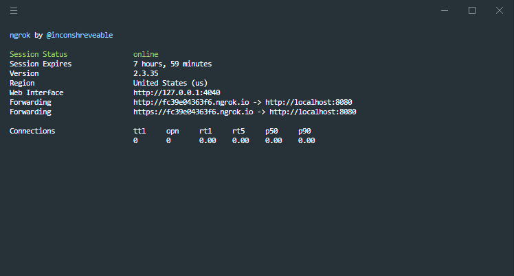
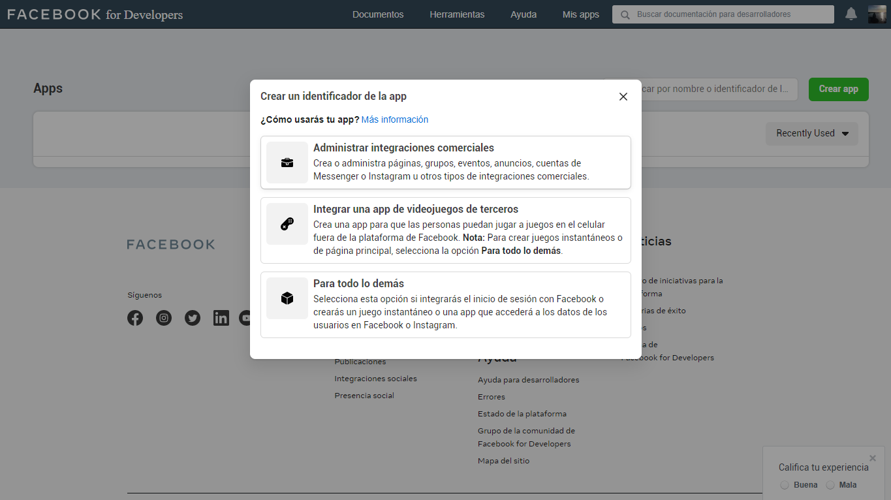
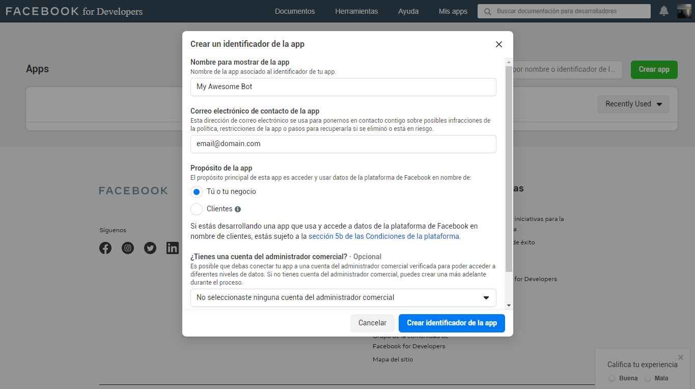
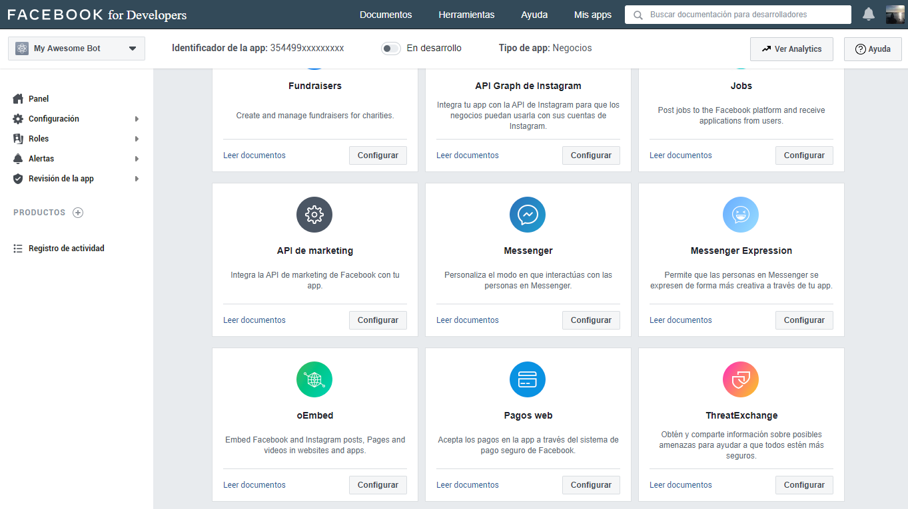
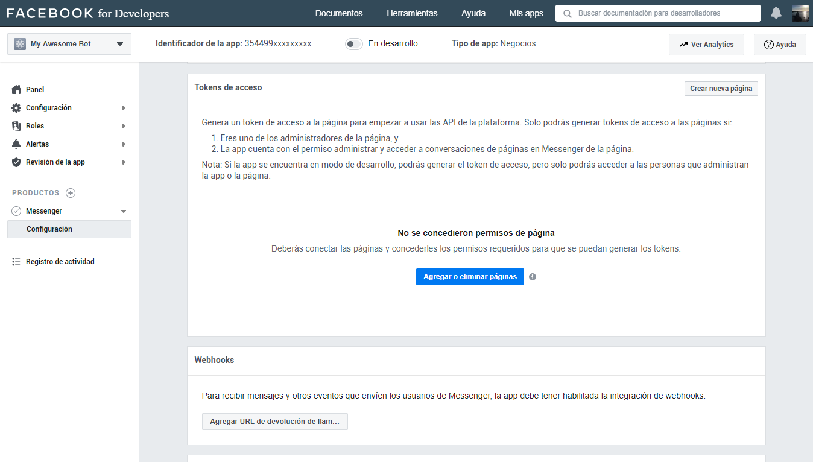
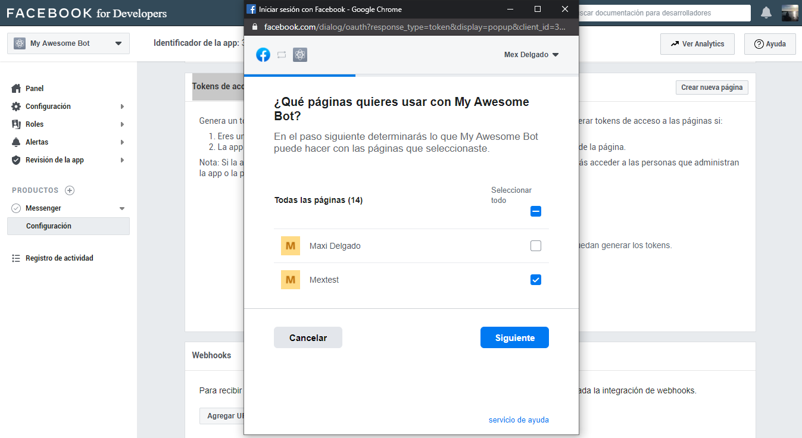
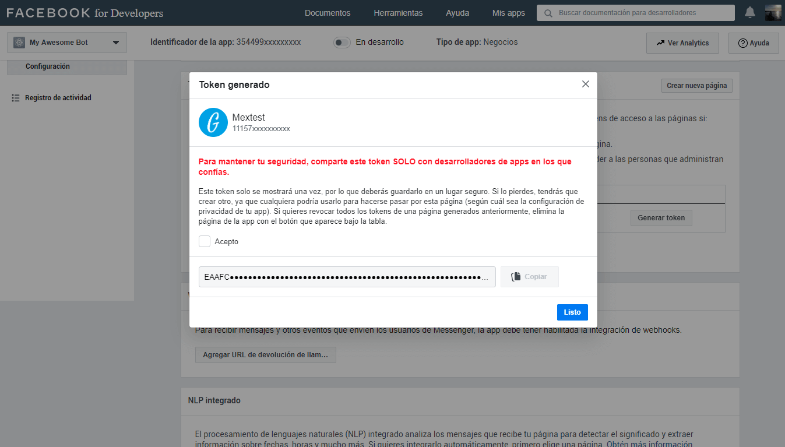
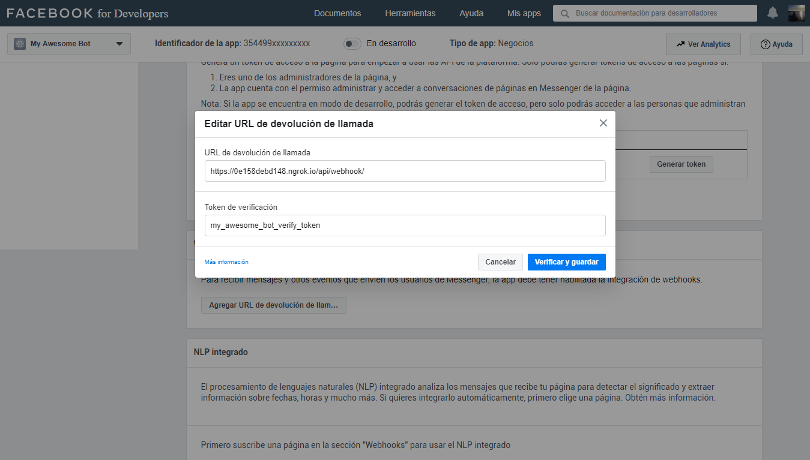
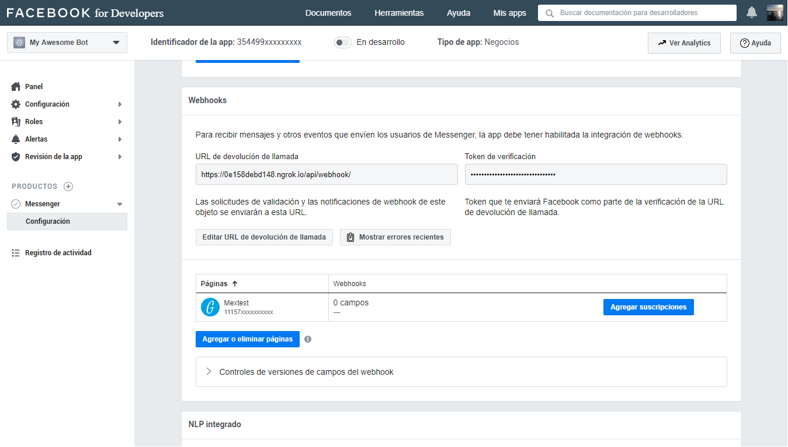
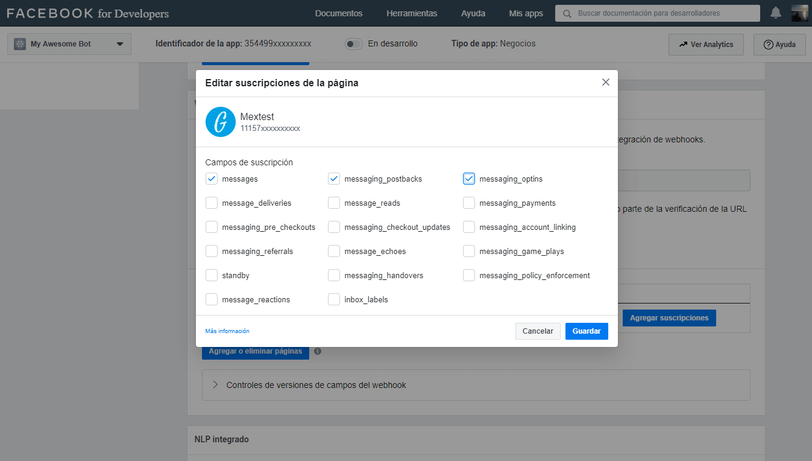

<p align="center">
  
</p>

<p align="center">
  <a href="https://nodejs.org/es/">
    
  </a>
  <a href="https://www.npmjs.com/">
    
  </a>
  <a href="https://expressjs.com/">
      
    </a>
    <a href="https://developers.facebook.com/docs/graph-api/overview">
          
        </a>
  <br />
</p>

> 💬 **Note from developer**
>
> This application is a starter for the creation of bots for Facebook Messenger and WorkChat (Workplace) for demonstration and education purposes. Its configuration is robust and scalable and can be used in a productive environment. Use this application to learn, experiment, retouch and practice the different options offered by the Facebook API.
>
> For more information about the Facebook API you can read the [documentation](https://developers.facebook.com/docs/messenger-platform) that the Messenger team prepared.

---

## Glossary

- [🤔 How does the Messenger platform work?](#how-does-the-messenger-platform-work)
- [🙌 Let's start](#lets-start)
  - [📝 Basic requirements](#basic-requirements)
  - [💻 Install dependencies](#install-dependencies)
  - [🛠 Configurations](#configurations)
  - [⚙ Run server](#run-server)
  - [📱 Setup the Facebook App](#setup-the-facebook-app)
  - [🖇 Create a shortlink](#create-a-shortlink)
- [👨‍💻 Author](#author)
- [📜 License](#license)

<a name="how-does-the-messenger-platform-work"></a>

## 🤔 How does the Messenger platform work?

Messaging bots use a web server to process the messages they receive or to find out which messages to send. It is also necessary for the bot to be authenticated to talk to the web server and for the bot to be approved by Facebook to talk to the public.

When a person sends a message to a company in Messenger, the following happens, as long as the page uses an app to partially or completely automate the conversations. The Facebook server sends webhooks to the URL of the company's server where the message app is hosted. That app can then reply to the person in Messenger using the Send API. This allows developers to create guided conversations for people to perform an automated process or develop an app that serves as a link between your agents and your company's Messenger presence.

<p align="center">
  
</p>

<a name="lets-start"></a>

## 🙌 Let's start

Before starting to work on our bot, we must have installed some tools in our computer that will facilitate us to work locally and be able to test some functionalities that the starter has available, and I will take for granted some basic concepts so as not to go into detail and extend the documentation.

<a name="basic-requirements"></a>

#### 📝 Basic requirements

- Node.js v10.15.3 or higher ([Download](https://nodejs.org/es/download/))
- NPM v6.4.1 or higher
- [Ngrok](https://ngrok.com/download) will allow us to create a connection tunnel between our local server and the facebook server.
- [Account on Facebook developers](https://developers.facebook.com/)
- [A test page on facebook ](https://www.facebook.com/pages/creation/?ref_type=comet_home)

<a name="install-dependencies"></a>

#### 💻 Install dependencies

When we have the basic requirements, we clone the repository, go to the project folder and install its dependencies.

```
 npm install
```

We download the latest version of [Ngrok](https://ngrok.com/download) compatible with our operating system, and decompress it in the server root.

<a name="configurations"></a>

## 🛠 Configurations

This application uses the [config](https://www.npmjs.com/package/config) dependency to facilitate the configuration of environment variables, which makes it scalable and robust when deploying the application in different environments.

In the path `./config` you will find a file called `development.json` which contains the settings for a local environment, while the file `custom-environment-variables.json` gets the key values of the environment variables displayed on the server.

Basically the file works as an object that is exported and can be consumed by invoking it in the file that requires consuming the loaded information.
If you need to add another type of data to consume, like the connection to a database, the url of some microservice, etc. you just have to add it to both files keeping the scheme.

> You may find that you can't configure some values for now, but that's not a problem, when using the `nodemon` dependency, the server is in a watching state that at the slightest change of code, the server will run again.

```json5
{
  server: {
    url: '',
    port: 8080,
    context: '/api',
    origins: 'http://localhost:3000,http://localhost:3001,http://localhost:8080',
    originsReadOnly: 'http://localhost:3001',
    corsEnabled: 'false',
    tz: 'America/Argentina/Buenos_Aires',
    showLogInterceptor: 'false',
  },
  params: {
    fbApiVersion: 'v8.0',
    verifyToken: 'my_awesome_bot_verify_token',
    accessToken: '',
    subscribedFields: 'messages,messaging_postbacks,messaging_optins',
    secrets: '',
  },
  services: {
    fbApiUrl: 'https://graph.facebook.com',
  },
  swagger: {
    enabled: 'true',
  },
}
```

<details>
<summary>See all available configuration properties in detail.</summary>

#### Server

`url`: It is the url of the server deployed in some environment, in the case of running it locally, you enter the url with `ssl` provided by **ngrok**.

- Type: `String`
- Default:

`port`: Is the port in which the application is deployed.

- Type: `Number`
- Default: `8080`

`context`: It is the context from which the server's api can be accessed, this way the routes in the main path of the application are not exposed.

- Type: `String`
- Default: `/api`

`origins`: The origins serve so that the application can only be consumed by reliable urls and avoid any kind of unwanted and malicious requests. You should write the urls separated with comma.

- Type: `String`
- Default: `http://localhost:3000,http://localhost:3001,http://localhost:8080`

`originsReadOnly`: It is the configuration of the urls for CORS, which allows you to validate who can consume the server.

- Type: `String`
- Default: `http://localhost:3001`

`corsEnabled`: Enables or disables the use of CORS on the bot's server.

- Type: `Boolean`
- Default: `false`

`tz`: It is the configuration of the time zone. [List of time zones](https://en.wikipedia.org/wiki/List_of_tz_database_time_zones#List)

- Type: `String`
- Default: `America/Argentina/Buenos_Aires`

`showLogInterceptor`: Enables the display of the request interceptors in the logs.

- Type: `Boolean`
- Default: `false`

#### Params

`fbApiVersion`: Is the api version of facebook

- Type: `String`
- Default: `v8.0`

`verifyToken`: It is the verification token required by the application when invoked by facebook, this token is private and should not be exposed.

- Type: `String`
- Default: `my_awesome_bot_verify_token`

`accessToken`: The access token is the alphanumeric hash that is generated when you create the application on **Fecebook** or **Workplace**.

- Type: `String`
- Default:

`subscribedFields`: Are the permissions required to subscribe to the application in order to interact with the user. These permissions are only required for Facebook bots and must be typed separately by comma.

- Type: `String`
- Default: `messages,messaging_postbacks,messaging_optins`

`secrets`: Here you can enter any value you want to hide in the server logs of the bot, for example the id of the sender or the id of the sender. The values to hide must be written separated by comma.

- Type: `String`
- Default:

#### services

`fbApiUrl`: It is the url of the Graph API of Feacebook

- Type: `String`
- Default: `https://graph.facebook.com`

#### swagger

`enabled`: Enable or disable the documentation of the bot's server endpoints with swagger.

- Type: `Boolean`
- Default: `true`

</details>

<a name="run-server"></a>

## ⚙ Run server

We start the bot's server.

```
npm run start
```

<p align="center">
  
</p>

Once the server is started, we must start **ngrok** to create the connection tunnel between the bot's local server and the Facebook server.

```
./ngrok http 8080
```

###### Windows

```
./ngrok.exe http 8080
```

<p align="center">
  
</p>

To see other tunnel configurations, you can check the [documentation](https://ngrok.com/docs)

<a name="setup-the-facebook-app"></a>

## 📱 Setup the Facebook App

The time has come to create and configure our app on Facebook.

With the local server and the connection tunnel initialized, we will configure the app, and with the information that it will give us we will finish configuring the data that we are missing in the bot's server.

> 💬 Remember that the bot's server is in watch mode, and any changes made will be re-initialized and take the changes made.

1. Enter [Facebook Developers](https://developers.facebook.com/apps/) and click on create app, it will open a mode to select the type of application, in our case we will create an application type "**Manage business integrations**".
<p align="center">
  
</p>

2. Now we will have to make some basic settings for the application.

   We assign a name of the app to identify it, we put a contact email, we select the purpose of the app, in this case is for us, and if we have a commercial administrator account, we select one from the list, if you do not have such an account, you can create it later.

   Once the information is completed, we click on **Create App identifier**
    <p align="center">
      
    </p>

3. Then we look for **Messenger** in the app's product list, and hit the configure button.
<p align="center">
  
</p>

4. Now we are going to make the two necessary and essential configurations to be able to connect Facebook with our bot server.

    <p align="center">
      
    </p>
    
   #### Access tokens
   In this part of the configuration, we will be able to manage which page or pages of facebook will have the bot available.
   We click on **Add or Remove pages**, and select the page.

    <p align="center">
      
    </p>
    
    Once the page is linked to the app, we have to generate the token by clicking on the button **Generate Token**, and a window will open where you give us some instructions about the token. 
    
    We must check accept in order to view the full hash, then copy it and place it in the configuration of our server, if it is for development it is put in the json of `./config/development.json` in the key of `accessToken`, and if it is for a productive environment, we must put it in the envs file in `./variables`.
    
    <p align="center">
        
    </p>
    
    ```json5
    {
      ...
      params: {
        ...
        accessToken: '<access_token>',
        ...
      },
     ...
    }
    ```
    
    #### Webhooks
    Now we have to configure the connection between Facebook and our server through **Webhook**, for this, you must have at hand the `verifyToken` that you configured and the bot's server url, in this case, we will use the one provided by **ngrok** with ssl.
    ```
   https://<id_tunnel>.ngrok.io/api/webhook/
   ```
    <p align="center">
        
    </p>
    
    Then click on **Verify and Save**, and if everything goes well, in the server terminal you should see the successful subscription message.
    
    <p align="center">
        
    </p>
    
    If the url of the webhook by ngrok changes, or you want to configure the url of the productive server, you can do it by clicking on the button **Edit Callback URL** and perform again the previous steps.
    
    #### Add subscriptions
    Now we have to add the subscriptions that will allow the bot to have certain permissions to perform the actions we need.
    
    For that we click on the button **Add subscriptions**
    
    <p align="center">
        
    </p>
    
    Select from the list the basic permissions and click on **Save** 
    
    Then we add each permission to the configuration files separated by a comma.
    
    <p align="center">
        
    </p>
    
    ```json5
    {
      ...
      params: {
        ...
        subscribedFields: 'messages,messaging_postbacks,messaging_optins',
        ...
      },
      ...
    }
    ```

5. These are the last settings to be made and are optional.
   It consists in executing a curl script in the terminal to implement some options, don't forget to put the access token to make it work.

   #### Add button Get Started

   ```bash
   curl -X POST -H "Content-Type: application/json" -d '{
        "get_started": {
            "payload": "GET_STARTED_PAYLOAD"
        }
   }' "https://graph.facebook.com/v8.0/me/messenger_profile?access_token=<access_token>"
   ```

   #### Add greeting

   ```bash
   curl -X POST -H "Content-Type: application/json" -d '{
   "greeting": [
        {
            "locale": "default",
            "text": "Hi {{user_first_name}}, i'm a bot!"
        }
   ]
   }' "https://graph.facebook.com/v8.0/me/messenger_profile?access_token=<access_token>"
   ```

   #### Add persistent menu

   ```bash
   curl -X POST -H "Content-Type: application/json" -d '{
      "persistent_menu":[
         {
            "locale":"default",
            "composer_input_disabled":false,
            "call_to_actions":[
               {
                  "title":"About us",
                  "type":"postback",
                  "payload":"ABOUT_US_PAYLOAD"
               },
               {
                  "title":"Contact",
                  "type":"postback",
                  "payload":"CONTACT_PAYLOAD"
               },
               {
                  "type":"web_url",
                  "title":"💻 Visit my Website",
                  "url":"http://misite.com/",
                  "webview_height_ratio":"full"
               }
            ]
         }
      ]
   }' "https://graph.facebook.com/v8.0/me/messenger_profile?access_token=<access_token>"
   ```

   #### Remove persistent menu

   ```bash
   curl -X DELETE -H "Content-Type: application/json" -d '{
       "fields":[
            "persistent_menu"
       ]
   }' "https://graph.facebook.com/v8.0/me/messenger_profile?access_token=<access_token>"
   ```

### 🙌 End of configuration

We have finished configuring the app so that Facebook connects to the bot's server, now we have to test it, to do this we can enter the chat page and perform a test to verify that everything is working properly.

<a name="create-a-shortlink"></a>

#### 🖇 Create a shortlink

You can use page username to have someone start a chat.

```
https://m.me/<PAGE_USERNAME>
```

<a name="author"></a>

## 👨‍💻 Author

[](mailto:mdelgado@tresdoce.com.ar 'Send email to Mex')

<a name="license"></a>
📜 [License MIT](license.md)
