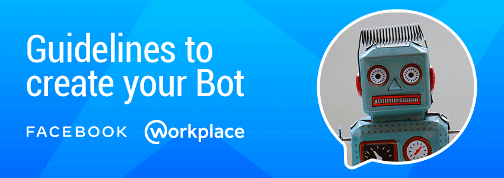

<p align="center">
  
</p>

<p align="center">
  <a href="https://nodejs.org/es/">
    
  </a>
  <a href="https://www.npmjs.com/">
    
  </a>
  <a href="https://expressjs.com/">
      
    </a>
    <a href="https://expressjs.com/">
          
        </a>
  <br />
</p>

> 💬 **Note from developer**
>
> This application is a starter for the creation of bots for Facebook Messenger and WorkChat (Workplace) for demonstration and education purposes. Its configuration is robust and scalable and can be used in a productive environment. Use this application to learn, experiment, retouch and practice the different options offered by the Facebook API.
>
>For more information about the Facebook API you can read the [documentation](https://developers.facebook.com/docs/messenger-platform) that the Messenger team prepared.
>
---

## Glossary

- [🤔 How does the Messenger platform work?](#how-does-the-messenger-platform-work)

- [Dependencies and libraries](#dependencies-and-libraries)
- [Setup workspace](#setup-workspace)
- [Scripts of run](#scripts-of-run)
  - [End-2-End testing](#end-2-end-testing)
  - [Generate reports](#generate-reports)
- [Custom configuration](#custom-configuration)
- [Custom environment variables](#custom-environment-variables)
- [Access Redux Store](#access-redux-store)
- [To Do/Features](#features)
- [Troubleshooting](#troubleshooting)
- [Contributing](#contributing)
- [Badges/Shields Generator](#badges-shields-generator)
- [Authors](#authors)

<a name="how-does-the-messenger-platform-work"></a>
## 🤔 How does the Messenger platform work?

Messaging bots use a web server to process the messages they receive or to find out which messages to send. It is also necessary for the bot to be authenticated to talk to the web server and for the bot to be approved by Facebook to talk to the public.

When a person sends a message to a company in Messenger, the following happens, as long as the page uses an app to partially or completely automate the conversations. The Facebook server sends webhooks to the URL of the company's server where the message app is hosted. That app can then reply to the person in Messenger using the Send API. This allows developers to create guided conversations for people to perform an automated process or develop an app that serves as a link between your agents and your company's Messenger presence.

<p align="center">
  
</p>

## 🙌 Let's start

Before starting to work on our bot, we must have installed some tools in our computer that will facilitate us to work locally and be able to test some functionalities that the starter has available, and I will take for granted some basic concepts so as not to go into detail and extend the documentation.

#### Basic requirements
 - Node.js v10.15.3 or higher ([Download](https://nodejs.org/es/download/))
 - NPM v6.4.1 or higher
 - [Ngrok](https://ngrok.com/download) will allow us to create a connection tunnel between our local server and the facebook server.
 - [Account on Facebook developers](https://developers.facebook.com/)
 - [A test page on facebook ](https://www.facebook.com/pages/creation/?ref_type=comet_home)

#### Install dependencies 
 When we have the basic requirements, we clone the repository, go to the project folder and install its dependencies.

```
 npm install
```

## Configurations

### *Setup the Facebook App*

1. Create or configure a Facebook App or Page here https://developers.facebook.com/apps/

    

2. In the app go to Messenger tab then click Setup Webhook. Here you will put in the URL of your Heroku server and a token. Make sure to check all the subscription fields.

    

3. Get a Page Access Token and save this somewhere.

    

4. Go back to Terminal and type in this command to trigger the Facebbook app to send messages. Remember to use the token you requested earlier.

    ```bash
    curl -X POST "https://graph.facebook.com/v2.6/me/subscribed_apps?access_token=<PAGE_ACCESS_TOKEN>"
    ```

### *Setup the bot*

Now that Facebook and Heroku can talk to each other we can code out the bot.

1. Add an API endpoint to _index.js to process messages. Remember to also include the token we got earlier.

    ```javascript
    app.post('/webhook/', function (req, res) {
	    let messaging_events = req.body.entry[0].messaging
	    for (let i = 0; i < messaging_events.length; i++) {
		    let event = req.body.entry[0].messaging[i]
		    let sender = event.sender.id
		    if (event.message && event.message.text) {
			    let text = event.message.text
			    sendTextMessage(sender, "Text received, echo: " + text.substring(0, 200))
		    }
	    }
	    res.sendStatus(200)
    })

    const token = "<PAGE_ACCESS_TOKEN>"
    ```

    **Optional, but recommended**: keep your app secrets out of version control!
    - On Heroku, its easy to create dynamic runtime variables (known as [config vars](https://devcenter.heroku.com/articles/config-vars)). This can be done in the Heroku dashboard UI for your app **or** from the command line:
    
    ```bash
    heroku config:set FB_PAGE_ACCESS_TOKEN=fake-access-token-dhsa09uji4mlkasdfsd

    # view
    heroku config
    ```

    - For local development: create an [environmental variable](https://en.wikipedia.org/wiki/Environment_variable) in your current session or add to your shell config file.
    ```bash
    # create env variable for current shell session
    export FB_PAGE_ACCESS_TOKEN=fake-access-token-dhsa09uji4mlkasdfsd

    # alternatively, you can add this line to your shell config
    # export FB_PAGE_ACCESS_TOKEN=fake-access-token-dhsa09uji4mlkasdfsd

    echo $FB_PAGE_ACCESS_TOKEN
    ```

    - `config var` access at runtime
    ``` javascript
    const token = process.env.FB_PAGE_ACCESS_TOKEN
    ```


3. Add a function to echo back messages

    ```javascript
    function sendTextMessage(sender, text) {
	    let messageData = { text:text }
	    request({
		    url: 'https://graph.facebook.com/v2.6/me/messages',
		    qs: {access_token:token},
		    method: 'POST',
    		json: {
			    recipient: {id:sender},
    			message: messageData,
    		}
    	}, function(error, response, body) {
    		if (error) {
			    console.log('Error sending messages: ', error)
    		} else if (response.body.error) {
			    console.log('Error: ', response.body.error)
		    }
	    })
    }
    ```

4. Commit the code again and push to Heroku

    ```
    git add .
    git commit -m 'updated the bot to speak'
    git push heroku master
    ```

5. Go to the Facebook Page and click on Message to start chatting!


## ⚙ Customize what the bot says

### *Send a Structured Message*

Facebook Messenger can send messages structured as cards or buttons.


1. Copy the code below to _index.js to send an test message back as two cards.

    ```javascript
    function sendGenericMessage(sender) {
	    let messageData = {
		    "attachment": {
			    "type": "template",
			    "payload": {
    				"template_type": "generic",
				    "elements": [{
    					"title": "First card",
					    "subtitle": "Element #1 of an hscroll",
					    "image_url": "http://messengerdemo.parseapp.com/img/rift.png",
					    "buttons": [{
						    "type": "web_url",
						    "url": "https://www.messenger.com",
						    "title": "web url"
					    }, {
						    "type": "postback",
						    "title": "Postback",
						    "payload": "Payload for first element in a generic bubble",
					    }],
				    }, {
					    "title": "Second card",
					    "subtitle": "Element #2 of an hscroll",
					    "image_url": "http://messengerdemo.parseapp.com/img/gearvr.png",
					    "buttons": [{
						    "type": "postback",
						    "title": "Postback",
						    "payload": "Payload for second element in a generic bubble",
					    }],
				    }]
			    }
		    }
	    }
	    request({
		    url: 'https://graph.facebook.com/v2.6/me/messages',
		    qs: {access_token:token},
		    method: 'POST',
		    json: {
			    recipient: {id:sender},
			    message: messageData,
		    }
	    }, function(error, response, body) {
		    if (error) {
			    console.log('Error sending messages: ', error)
		    } else if (response.body.error) {
			    console.log('Error: ', response.body.error)
		    }
	    })
    }
    ```

2. Update the webhook API to look for special messages to trigger the cards

    ```javascript
    app.post('/webhook/', function (req, res) {
	    let messaging_events = req.body.entry[0].messaging
	    for (let i = 0; i < messaging_events.length; i++) {
		    let event = req.body.entry[0].messaging[i]
		    let sender = event.sender.id
		    if (event.message && event.message.text) {
			    let text = event.message.text
			    if (text === 'Generic') {
				    sendGenericMessage(sender)
			    	continue
			    }
			    sendTextMessage(sender, "Text received, echo: " + text.substring(0, 200))
		    }
	    }
	    res.sendStatus(200)
    })
    ```

### *Act on what the user messages*

What happens when the user clicks on a message button or card though? Let's update the webhook API one more time to send back a postback function.

```javascript
  app.post('/webhook/', function (req, res) {
    let messaging_events = req.body.entry[0].messaging
    for (let i = 0; i < messaging_events.length; i++) {
      let event = req.body.entry[0].messaging[i]
      let sender = event.sender.id
      if (event.message && event.message.text) {
  	    let text = event.message.text
  	    if (text === 'Generic') {
  		    sendGenericMessage(sender)
  		    continue
  	    }
  	    sendTextMessage(sender, "Text received, echo: " + text.substring(0, 200))
      }
      if (event.postback) {
  	    let text = JSON.stringify(event.postback)
  	    sendTextMessage(sender, "Postback received: "+text.substring(0, 200), token)
  	    continue
      }
    }
    res.sendStatus(200)
  })
```

Git add, commit, and push to Heroku again.

Now when you chat with the bot and type 'Generic' you can see this.

   

## 📡 How to share your bot

### *Add a chat button to your webpage*

Go [here](https://developers.facebook.com/docs/messenger-platform/plugin-reference) to learn how to add a chat button your page.

### *Create a shortlink*

You can use https://m.me/<PAGE_USERNAME> to have someone start a chat.

## 💡 What's next?

You can learn how to get your bot approved for public use [here](https://developers.facebook.com/docs/messenger-platform/app-review).

You can also connect an AI brain to your bot [here](https://wit.ai)

Read about all things chat bots with the ChatBots Magazine [here](https://medium.com/chat-bots)

You can also design Messenger bots in Sketch with the [Bots UI Kit](https://bots.mockuuups.com)!

## How I can help

I build and design bots all day. Email me for help!


git add . && git commit -am "Update code" && git push heroku master


========================================================


[Facebook Developers - Messenger](https://developers.facebook.com/docs/messenger-platform)

### CURLS

#### Add btn get_started
```sh
curl -X POST -H "Content-Type: application/json" -d '{ 
    "get_started": {
        "payload": "GET_STARTED_PAYLOAD"
    }
}' "https://graph.facebook.com/v8.0/me/messenger_profile?access_token=<access_token>"
```

#### Add greeting
```sh
curl -X POST -H "Content-Type: application/json" -d '{
    "greeting": [{
      "locale": "default",
      "text": "Hola {{user_first_name}} soy un bot!"
    }]
}' "https://graph.facebook.com/v8.0/me/messenger_profile?access_token=<access_token>"
```

#### Add persistent menu
```sh
curl -X POST -H "Content-Type: application/json" -d '{
   "persistent_menu":[
      {
         "locale":"default",
         "composer_input_disabled":false,
         "call_to_actions":[
            {
               "title":"<TITLE_FOR_THE_CTA>",
               "type":"postback",
               "payload":"<USER_DEFINED_PAYLOAD>"
            },
            {
               "title":"TITLE_FOR_THE_CTA_2",
               "type":"postback",
               "payload":"USER_DEFINED_2_PAYLOAD"
            },
            {
               "type":"web_url",
               "title":"My Website",
               "url":"http://mysite.com/",
               "webview_height_ratio":"full"
            }
         ]
      }
   ]
}' "https://graph.facebook.com/v8.0/me/messenger_profile?access_token=<access_token>"
```

#### Remove persistent menu
```sh
curl -X DELETE -H "Content-Type: application/json" -d '{
    "fields":[
        "persistent_menu"
    ]
}' "https://graph.facebook.com/v8.0/me/messenger_profile?access_token=<access_token>"
```


#### Text message
```json5
{
  sender: {
    id: '<SENDER_ID>',
  },
  recipient: {
    id: '<PAGE_ID>',
  },
  timestamp: 1598801580458,
  message: {
    mid: '<HASH>',
    text: 'hola',
    nlp: {
      intents: [],
      entities: {},
      traits: {},
      detected_locales: [],
    },
  },
}
```

#### Quick reply
```json5
{
  sender: {
    id: '<SENDER_ID>',
  },
  recipient: {
    id: '<PAGE_ID>',
  },
  timestamp: 1598802076308,
  message: {
    mid: '<HASH>',
    text: '<TITLE_FOR_THE_CTA>',
    nlp: {
      intents: [],
      entities: {},
      traits: {},
      detected_locales: [],
    },
    quick_reply: {
      payload: '<USER_DEFINED_PAYLOAD>',
    },
  },
}
```

#### Attachment
```json5
{
  sender: {
    id: '<SENDER_ID>',
  },
  recipient: {
    id: '<PAGE_ID>',
  },
  timestamp: 1598802331198,
  message: {
    mid: '<HASH>',
    attachments: [
      {
        type: '<image | video | audio | files>',
        payload: {
          url: '<URL_ATTACHMENT>',
        },
      },
    ],
  },
}
```

#### Postback
```json5
{
  sender: {
    id: '<SENDER_ID>',
  },
  recipient: {
    id: '<PAGE_ID>',
  },
  timestamp: 1598801372318,
  postback: {
    title: '<TITLE_FOR_THE_CTA>',
    payload: '<USER_DEFINED_PAYLOAD>',
  },
}
```

## Author

[](mailto:mdelgado@tresdoce.com.ar "Send email to Mex")