<p align="center">
  
</p>

<p align="center">
  <a href="https://nodejs.org/es/">
    
  </a>
  <a href="https://www.npmjs.com/">
    
  </a>
  <a href="https://expressjs.com/">
    
  </a>
  <a href="https://developers.facebook.com/docs/graph-api/overview">
    
  </a>
  <br/>
  <a href="https://github.com/rudemex/fb-messenger-bot/releases/latest">
    
  </a>
  <a href="https://travis-ci.org/github/rudemex/fb-messenger-bot">
    
  </a>        
  <a href="https://github.com/rudemex/fb-messenger-bot/blob/master/license.md">
      
    </a> 
  <br />
</p>

> 💬 **Note from developer**
>
> This application is a starter for the creation of bots for Facebook Messenger and WorkChat (Workplace) for demonstration and education purposes. Its configuration is robust and scalable and can be used in a productive environment. Use this application to learn, experiment, retouch and practice the different options offered by the Facebook API.
>
> For more information about the Facebook API you can read the [documentation](https://developers.facebook.com/docs/messenger-platform) that the Messenger team prepared.

---

## Glossary

- [🤔 How does the Messenger platform work?](#how-does-the-messenger-platform-work)
- [🤖 Live Demo](#live-demo)
- [🙌 Let's start](#lets-start)
  - [📝 Basic requirements](#basic-requirements)
  - [🛠 Install dependencies](#install-dependencies)
  - [⚙ Configurations](#configurations)
  - [💻 Run server](#run-server)
    - [📚 Swagger](#swagger-info)
  - [🖥️ Deploy server in heroku (free)](#deploy-in-heroku)
  - [📱 Setup the Facebook App](#setup-the-facebook-app)
    - [📡 How to share your bot](#how-to-share-your-bot)
    - [🔗 Create a shortlink](#create-a-shortlink)
  - [📱 Setup the Workplace App](#setup-the-workplace-app)
  - [🔐 Security configuration](#security-configuration)
- [🤦‍♂️Troubleshooting](#troubleshooting)
- [💡 Contributing](#contributing)
- [👨‍💻 Author](#author)
- [📜 License](#license)

<a name="how-does-the-messenger-platform-work"></a>

## 🤔 How does the Messenger platform work?

Messaging bots use a web server to process the messages they receive or to find out which messages to send. It is also necessary for the bot to be authenticated to talk to the web server and for the bot to be approved by Facebook to talk to the public.

When a person sends a message to a company in Messenger, the following happens, as long as the page uses an app to partially or completely automate the conversations. The Facebook server sends webhooks to the URL of the company's server where the message app is hosted. That app can then reply to the person in Messenger using the Send API. This allows developers to create guided conversations for people to perform an automated process or develop an app that serves as a link between your agents and your company's Messenger presence.

<p align="center">
  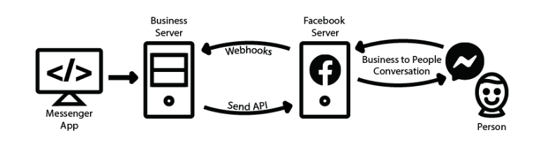
</p>

<a name="live-demo"></a>

## 🤖 Live Demo
You can try some functions of the bot by entering here.

[Live Demo](https://m.me/staterFbMessengerBot)

And you can try other kind of messages from the [server documentation](https://rudemex-fb-messenger-bot.herokuapp.com/api-docs), don't forget to get your ID from the chat bot persistent menu.


<a name="lets-start"></a>

## 🙌 Let's start

Before starting to work on our bot, we must have installed some tools in our computer that will facilitate us to work locally and be able to test some functionalities that the starter has available, and I will take for granted some basic concepts so as not to go into detail and extend the documentation.

<a name="basic-requirements"></a>

#### 📝 Basic requirements

- Node.js v10.15.3 or higher ([Download](https://nodejs.org/es/download/))
- NPM v6.4.1 or higher
- [Ngrok](https://ngrok.com/download) will allow us to create a connection tunnel between our local server and the facebook server.
- [Account on Facebook developers](https://developers.facebook.com/)
- [A test page on facebook ](https://www.facebook.com/pages/creation/?ref_type=comet_home)

<a name="install-dependencies"></a>

#### 🛠 Install dependencies

When we have the basic requirements, we clone the repository, go to the project folder and install its dependencies.

```
 npm install
```

We download the latest version of [Ngrok](https://ngrok.com/download) compatible with our operating system, and decompress it in the server root.

<a name="configurations"></a>

## ⚙ Configurations

This application uses the [config](https://www.npmjs.com/package/config) dependency to facilitate the configuration of environment variables, which makes it scalable and robust when deploying the application in different environments.

In the path `./config` you will find a file called `development.json` which contains the settings for a local environment, while the file `custom-environment-variables.json` gets the key values of the environment variables displayed on the server.

Basically the file works as an object that is exported and can be consumed by invoking it in the file that requires consuming the loaded information.
If you need to add another type of data to consume, like the connection to a database, the url of some microservice, etc. you just have to add it to both files keeping the scheme.

> You may find that you can't configure some values for now, but that's not a problem, when using the `nodemon` dependency, the server is in a watching state that at the slightest change of code, the server will run again.

```json5
{
  server: {
    url: '',
    port: 8080,
    context: '/api',
    origins: 'http://localhost:3000,http://localhost:3001,http://localhost:8080',
    originsReadOnly: 'http://localhost:3001',
    corsEnabled: 'false',
    tz: 'America/Argentina/Buenos_Aires',
    showLogInterceptor: 'false',
  },
  params: {
    fbApiVersion: 'v8.0',
    verifyToken: 'my_awesome_bot_verify_token',
    appSecret: '',
    accessToken: '',
    subscribedFields: 'messages,messaging_postbacks',
    userFields: 'id,name,first_name,last_name,email',
    secrets: '',
    requireProof: false
  },
  services: {
    fbApiUrl: 'https://graph.facebook.com',
  },
  swagger: {
    enabled: 'true',
  },
}
```

<details>
<summary>See all available configuration properties in detail.</summary>

#### Server

`url`: It is the url of the server deployed in some environment, in the case of running it locally, you enter the url with `ssl` provided by **ngrok**.

- Type: `String`
- Default:

`port`: Is the port in which the application is deployed.

- Type: `Number`
- Default: `8080`

`context`: It is the context from which the server's api can be accessed, this way the routes in the main path of the application are not exposed.

- Type: `String`
- Default: `/api`

`origins`: The origins serve so that the application can only be consumed by reliable urls and avoid any kind of unwanted and malicious requests. You should write the urls separated with comma.

- Type: `String`
- Default: `http://localhost:3000,http://localhost:3001,http://localhost:8080`

`originsReadOnly`: It is the configuration of the urls for CORS, which allows you to validate who can consume the server.

- Type: `String`
- Default: `http://localhost:3001`

`corsEnabled`: Enables or disables the use of CORS on the bot's server.

- Type: `Boolean`
- Default: `false`

`tz`: It is the configuration of the time zone. [List of time zones](https://en.wikipedia.org/wiki/List_of_tz_database_time_zones#List)

- Type: `String`
- Default: `America/Argentina/Buenos_Aires`

`showLogInterceptor`: Enables the display of the request interceptors in the logs.

- Type: `Boolean`
- Default: `false`

#### Params

`fbApiVersion`: Is the api version of facebook

- Type: `String`
- Default: `v8.0`

`verifyToken`: It is the verification token required by the application when invoked by facebook, this token is private and should not be exposed.

- Type: `String`
- Default: `my_awesome_bot_verify_token`

`appSecret`: It is the secret key to the app, it is required if you are going to use the security settings for the requests.
- Type: `String`
- Default: 

`accessToken`: The access token is the alphanumeric hash that is generated when you create the application on **Fecebook** or **Workplace**.

- Type: `String`
- Default:

`subscribedFields`: Are the permissions required to subscribe to the application in order to interact with the user. These permissions are only required for Facebook bots and must be typed separately by comma.

- Type: `String`
- Default: `messages,messaging_postbacks,messaging_optins`

`userFields`: It is a comma-separated list to obtain the user's information.[Documentation](https://developers.facebook.com/docs/graph-api/reference/user/)

- Type: `String`
- Default: `id,name,first_name,last_name,email`

`secrets`: Here you can enter any value you want to hide in the server logs of the bot, for example the id of the sender or the id of the sender. The values to hide must be written separated by comma.

- Type: `String`
- Default:

`requireProof`: Enables or disables the use of `appsecret_proof` and `appsecret_time` for security requests, it is required to have configured the secret key of the app to work.
- Type: `Boolean`
- Default: `false`

#### services

`fbApiUrl`: It is the url of the Graph API of Feacebook

- Type: `String`
- Default: `https://graph.facebook.com`

#### swagger

`enabled`: Enable or disable the documentation of the bot's server endpoints with [swagger](#swagger-info).

- Type: `Boolean`
- Default: `true`

</details>

<a name="run-server"></a>

## 💻 Run server

We start the bot's server.

```
npm run start
```

<p align="center">
  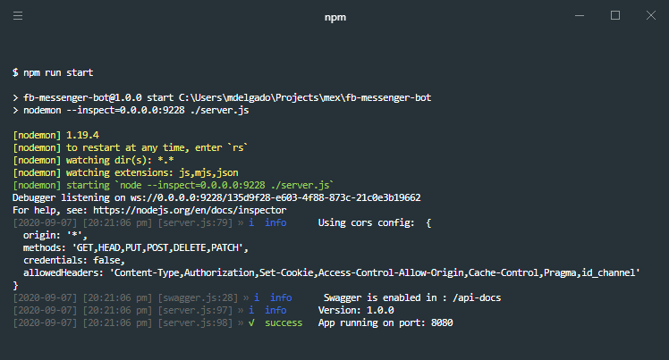
</p>

Once the server is started, we must start **ngrok** to create the connection tunnel between the bot's local server and the Facebook server.

```
./ngrok http 8080
```

###### Windows

```
./ngrok.exe http 8080
```

<p align="center">
  
</p>

To see other tunnel configurations, you can check the [documentation](https://ngrok.com/docs)

<a name="swagger-info"></a>

## 📚 Swagger

The project has a **Swagger** that has documented the most important endpoints of the project, and facilitates the configuration of the fields for the bot, such as the **get started** button, **persistent menu** and the **greeting**.

This documentation can be enabled or disabled from the [configuration](#configurations) files.

- Default: `http://localhost:8080/api-docs`

#### URL Scheme

```
<http|https>://<server_url><:port>/api-docs
```

<a name="deploy-in-heroku"></a>

## 🖥️ Deploy server in heroku (free)

You can run the bot server in a productive environment on any node server, in this case I will explain the steps to raise the server on the platform [Heroku](https://heroku.com/), which has a free version to deploy node servers, you can also hire a paid service which gives you more features.

> 💬 If you don't have a Heroku account, you can create one by going to [https://signup.heroku.com/](https://signup.heroku.com/).

We will need a file called `Procfile`, which is the one Heroku will use to initialize the server once deployed.

Its content is:

```
web: npm start
```

1. After logging into Heroku, click on Create new app

<p align="center">
   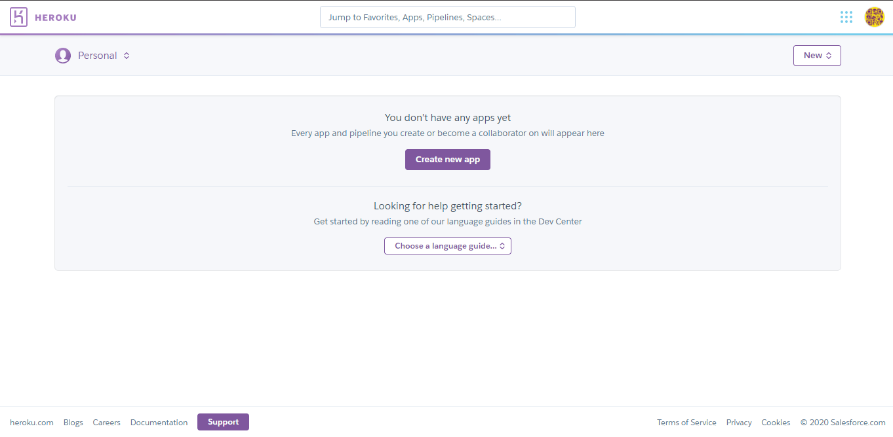
</p>

2. We write the name of our app, and select a region, and then click on Create App.
   > 💬 note: Remember to save the name of the app, as you will need it later to replace the value of <app_name> with the name of the app.

<p align="center">
   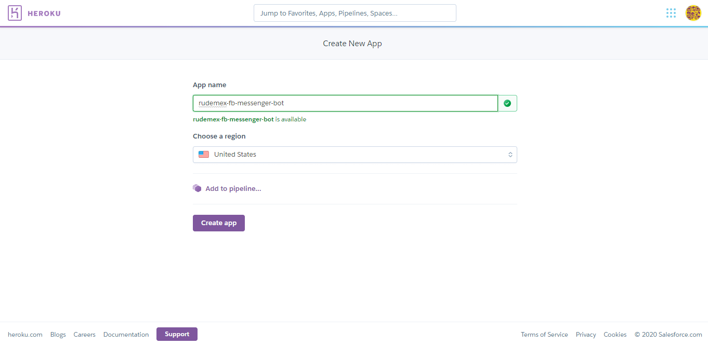
</p>

3. Heroku gives you several options to deploy your server. You can do it with [Heroku CLI](https://devcenter.heroku.com/articles/heroku-cli) by following the steps in the documentation, or you can deploy it directly from Github, which is much easier.

<p align="center">
   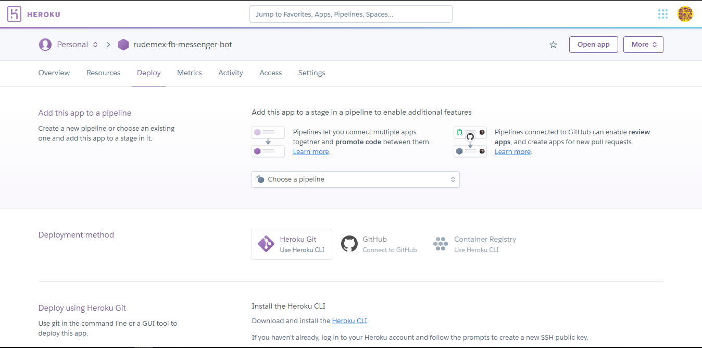
</p>

#### Deployment method: Heroku CLI

Download and install the [Heroku CLI](https://devcenter.heroku.com/articles/heroku-cli).

If you haven't already, log in to your Heroku account and follow the prompts to create a new SSH public key.

```
heroku login
```

##### Create a new Git repository

Initialize a git repository in a new or existing directory

```
cd my-project/
git init
heroku git:remote -a <app_name>
```

##### Deploy your application

Commit your code to the repository and deploy it to Heroku using Git.

```
git add .
git commit -am "make it better"
git push heroku master
```

##### Deploy your application

For existing repositories, simply add the heroku remote

```
heroku git:remote -a <app_name>
```

#### Deployment method: GitHub

We click on the connect to GitHub button, if you've never connected Heroku to Github, a window will open to authorize the connection so you can continue with the step of entering the name of the repository and searching it in your GitHub account, and once you find it, we click on the Connect button.

<p align="center">
   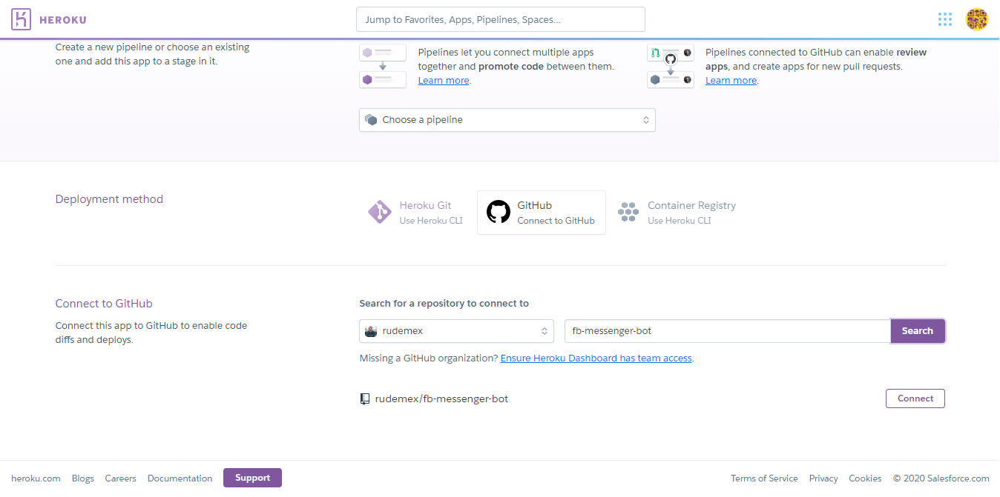
</p>

Then we select the branch we want to deploy, and click on Deploy Branch, and it will start running the deployment, downloading the code from the repository, installing the dependencies, etc.

<p align="center">
   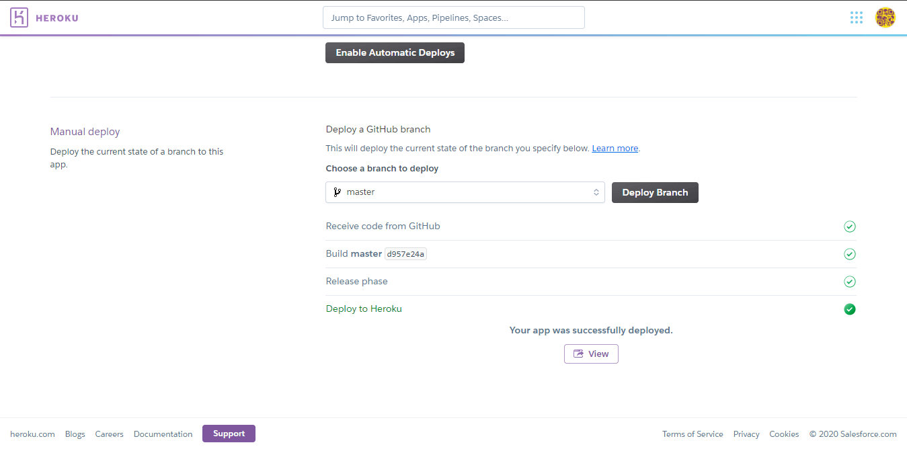
</p>

4. Now we have to configure the environment variables of the server, although we can do it manually from **Settings > Config Vars**, there is a bash script prepared that will raise the environment variables of our `.env` file that is located in the `./variables` folder.

```
npm run heroku:envs
```

or

```
bash heroku-envs.sh
```

<p align="center">
   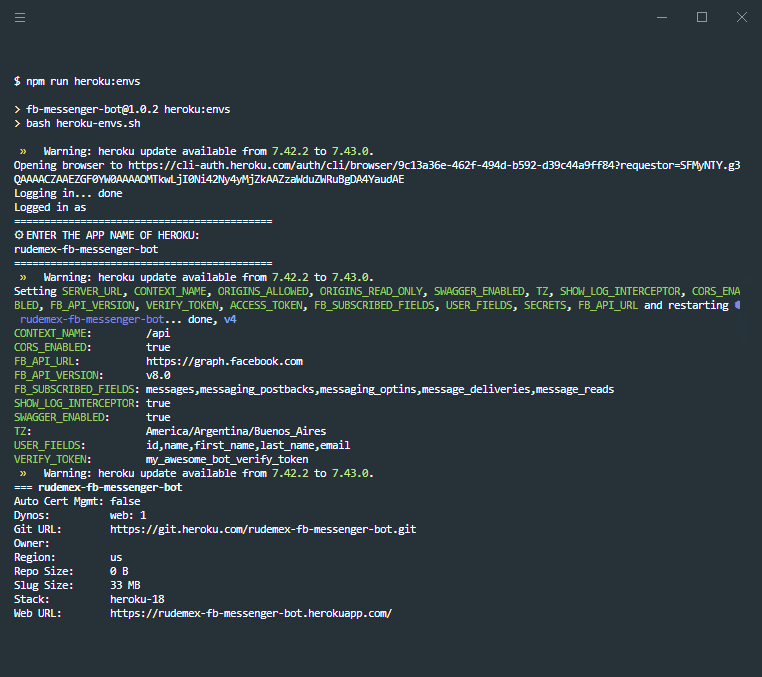
</p>

<a name="setup-the-facebook-app"></a>

## 📱 Setup the Facebook App

The time has come to create and configure our app on Facebook.

With the local server and the connection tunnel initialized, we will configure the app, and with the information that it will give us we will finish configuring the data that we are missing in the bot's server.

> 💬 Remember that the bot's server is in watch mode, and any changes made will be re-initialized and take the changes made.

1. Enter [Facebook Developers](https://developers.facebook.com/apps/) and click on create app, it will open a modal to select the type of application, in our case we will create an application type "**Manage business integrations**".
<p align="center">
  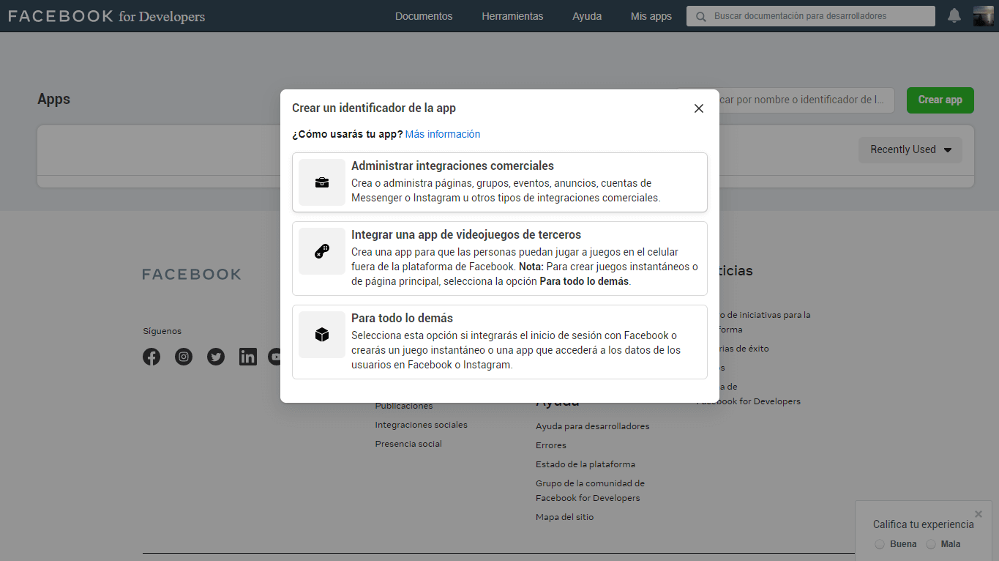
</p>

2. Now we will have to make some basic settings for the application.

   We assign a name of the app to identify it, we put a contact email, we select the purpose of the app, in this case is for us, and if we have a commercial administrator account, we select one from the list, if you do not have such an account, you can create it later.

   Once the information is completed, we click on **Create App identifier**
    <p align="center">
      
    </p>

3. Then we look for **Messenger** in the app's product list, and hit the configure button.
<p align="center">
  
</p>

4. Now we are going to make the two necessary and essential configurations to be able to connect Facebook with our bot server.

    <p align="center">
      
    </p>
    
   #### Access tokens
   In this part of the configuration, we will be able to manage which page or pages of facebook will have the bot available.
   We click on **Add or Remove pages**, and select the page.

    <p align="center">
      
    </p>
    
    Once the page is linked to the app, we have to generate the token by clicking on the button **Generate Token**, and a window will open where you give us some instructions about the token. 
    
    We must check accept in order to view the full hash, then copy it and place it in the configuration of our server, if it is for development it is put in the json of `./config/development.json` in the key of `accessToken`, and if it is for a productive environment, we must put it in the envs file in `./variables`.
    
    <p align="center">
        
    </p>
    
    ```json5
    {
      ...
      params: {
        ...
        accessToken: '<access_token>',
        ...
      },
     ...
    }
    ```
    
    #### Webhooks
    Now we have to configure the connection between Facebook and our server through **Webhook**, for this, you must have at hand the `verifyToken` that you configured and the bot's server url, in this case, we will use the one provided by **ngrok** with ssl.
    ```
   https://<id_tunnel>.ngrok.io/api/webhook/
   ```
    <p align="center">
        
    </p>
    
    Then click on **Verify and Save**, and if everything goes well, in the server terminal you should see the successful subscription message.
    
    <p align="center">
        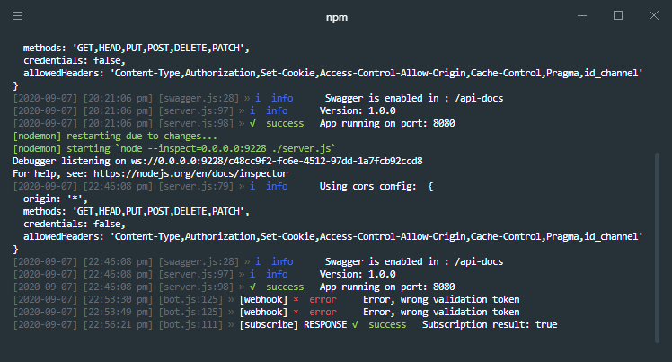
    </p>
    
    If the url of the webhook by ngrok changes, or you want to configure the url of the productive server, you can do it by clicking on the button **Edit Callback URL** and perform again the previous steps.
    
    #### Add subscriptions
    Now we have to add the subscriptions that will allow the bot to have certain permissions to perform the actions we need.
    
    For that we click on the button **Add subscriptions**
    
    <p align="center">
        
    </p>
    
    Select from the list the basic permissions and click on **Save** 
    
    Then we add each permission to the configuration files separated by a comma.
    
    <p align="center">
        
    </p>
    
    ```json5
    {
      ...
      params: {
        ...
        subscribedFields: 'messages,messaging_postbacks,messaging_optins',
        ...
      },
      ...
    }
    ```

5. These are the last settings to be made and are optional.
   It consists in executing a curl script in the terminal to implement some options, don't forget to put the access token to make it work.

   > 💬 Note: You can run these scripts from Swagger, but you must adjust the files that are inside the `./templates/configs` folder

   #### Add button Get Started

   ```bash
   curl -X POST -H "Content-Type: application/json" -d '{
        "get_started": {
            "payload": "GET_STARTED_PAYLOAD"
        }
   }' "https://graph.facebook.com/v8.0/me/messenger_profile?access_token=<access_token>"
   ```

   #### Add greeting

   ```bash
   curl -X POST -H "Content-Type: application/json" -d '{
   "greeting": [
        {
            "locale": "default",
            "text": "Hi {{user_first_name}}, i'm a bot!"
        }
   ]
   }' "https://graph.facebook.com/v8.0/me/messenger_profile?access_token=<access_token>"
   ```

   #### Add persistent menu

   ```bash
   curl -X POST -H "Content-Type: application/json" -d '{
      "persistent_menu":[
         {
            "locale":"default",
            "composer_input_disabled":false,
            "call_to_actions":[
               {
                  "title":"About us",
                  "type":"postback",
                  "payload":"ABOUT_US_PAYLOAD"
               },
               {
                  "title":"Contact",
                  "type":"postback",
                  "payload":"CONTACT_PAYLOAD"
               },
               {
                  "type":"web_url",
                  "title":"💻 Visit my Website",
                  "url":"http://misite.com/",
                  "webview_height_ratio":"full"
               }
            ]
         }
      ]
   }' "https://graph.facebook.com/v8.0/me/messenger_profile?access_token=<access_token>"
   ```

   #### Remove persistent menu

   ```bash
   curl -X DELETE -H "Content-Type: application/json" -d '{
       "fields":[
            "persistent_menu"
       ]
   }' "https://graph.facebook.com/v8.0/me/messenger_profile?access_token=<access_token>"
   ```

### 🙌 End of configuration

We have finished configuring the app so that Facebook connects to the bot's server, now we have to test it, to do this we can enter the chat page and perform a test to verify that everything is working properly.

<a name="how-to-share-your-bot"></a>

## 📡 How to share your bot

Add a chat button to your webpage, go [here](https://developers.facebook.com/docs/messenger-platform/plugin-reference) to learn how to add a chat button your page.

<a name="create-a-shortlink"></a>

#### 🔗 Create a shortlink

You can use page username to have someone start a chat.

```
https://m.me/<PAGE_USERNAME>
```

<a name="setup-the-workplace-app"></a>

## 📱 Setup the Workplace App

The configuration of the app for Workplace is quite similar to that of Facebook, it is required to have the Workplace paid account in order to enable custom integrations.

1. Go to the **Administrator Panel**, and click on the **Integrations** button, and in the Custom integrations section click on the **Create custom integration** button.

   It will open a modal where we must write the name of the application and a description, then click on **Create**.

   <p align="center">
       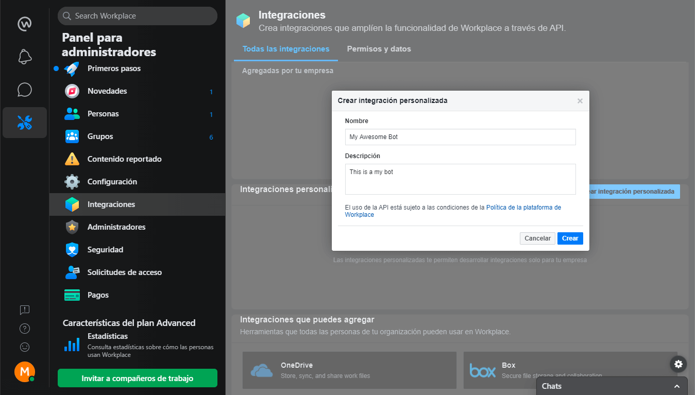
   </p>

2. Once the application is created, it takes us to the configuration page of the application.

   <p align="center">
       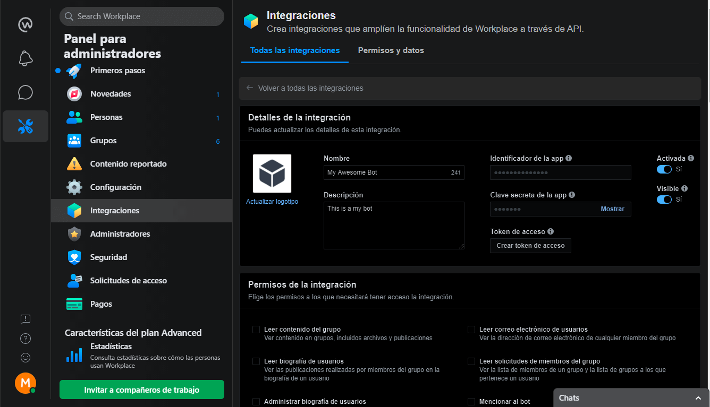
   </p>
    
    #### Access token

   Now we are going to generate an access token and then configure it in our config, as mentioned in the configuration of the Facebook app.

   <p align="center">
       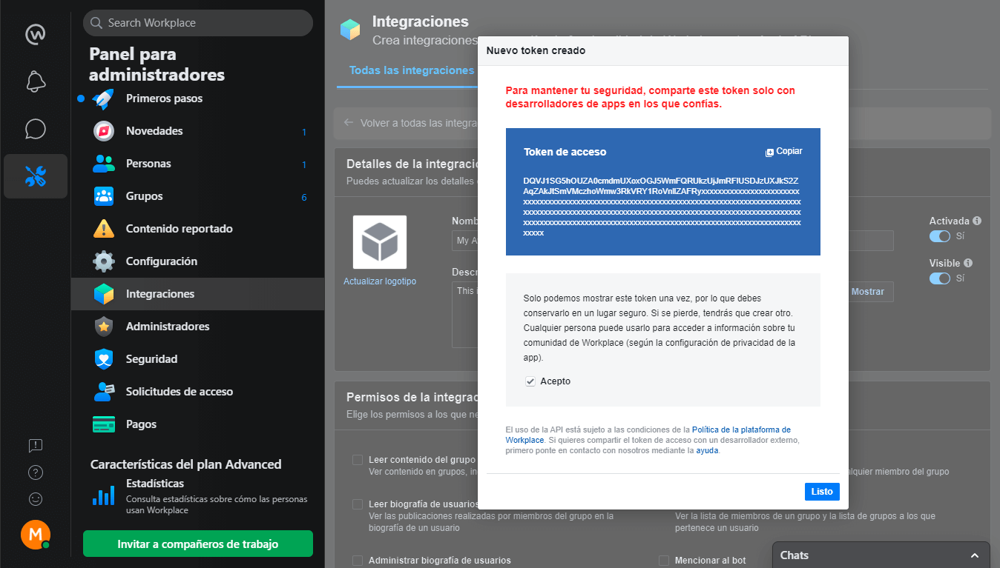
   </p>

3. Now let's select the permissions for our bot.

   #### Permissions

   In our case we are interested in the option of **Sending a message to any member**.

   <p align="center">
       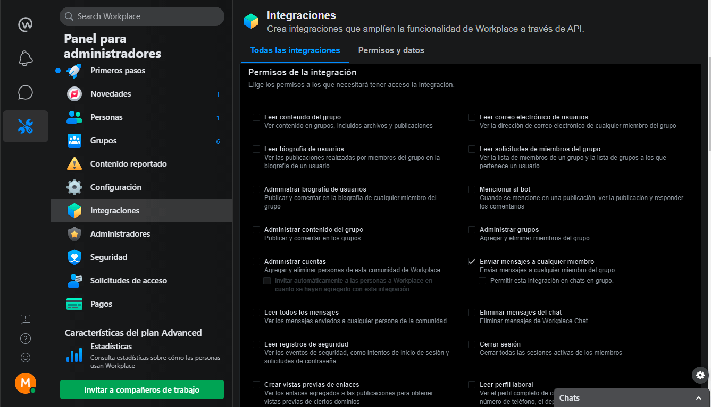
   </p>

4. Now we are going to **grant the integration access to groups**, in this case it is going to be to a specific group.

<p align="center">
    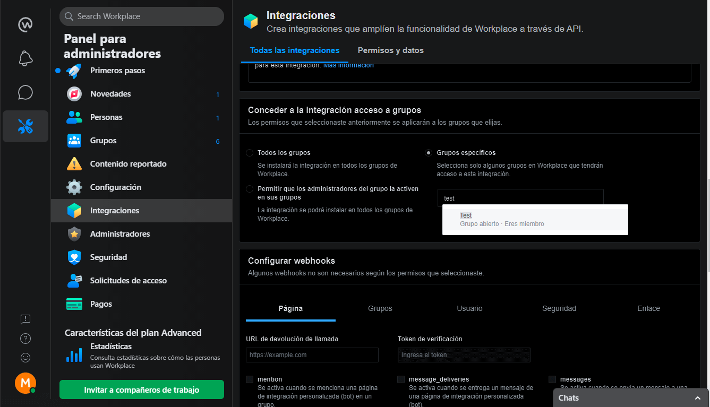
</p>

5. And finally, we have to configure the **Webhook** and the **verify token** and select the **subscriptions** we need, as we did with the Facebook app.

   <p align="center">
       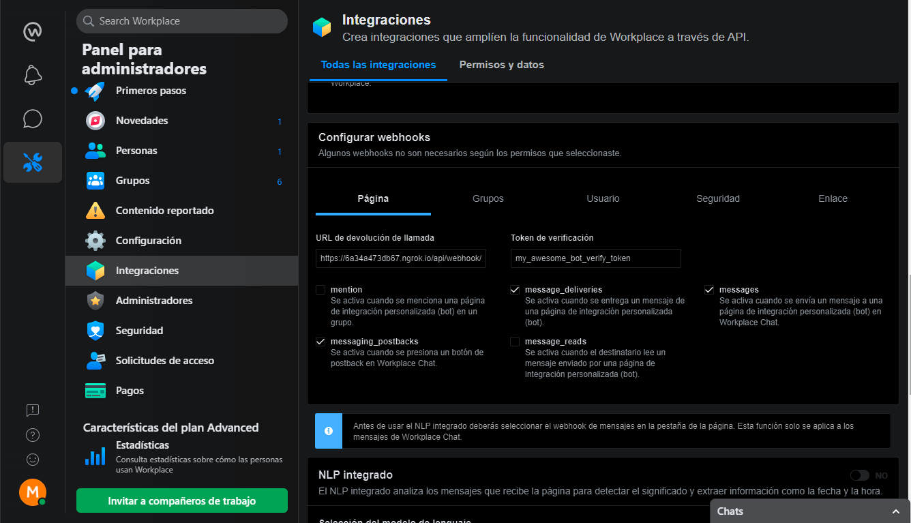
   </p>

   > 💬 Note: depending on the webhook configuration you select in the tabs, the subscriptions will change.

6. 🙌 Finally we click on the save button.

   > 💬 Note: there is an optional configuration which is the security one, where it is required to enter the ip of the bot's server, the domain, etc.

   <p align="center">
       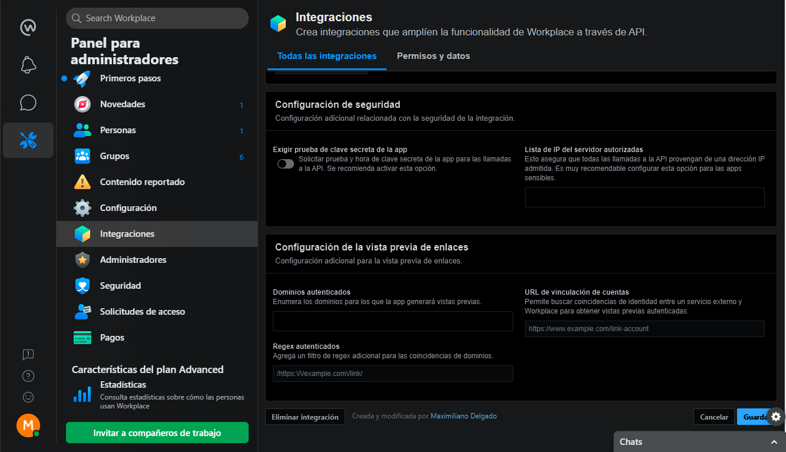
   </p>

<a name="security-configuration"></a>
## 🔐 Security Configuration

To give more security to the application, both for **Facebook** and **Workplace**, it is important to have completed the environment variable `appSecret` and have set `true` the `requireProof` for the bot to work properly with these new settings.

```json5
{
  ...
  "params": {
    "appSecret": "<app_secret_key>",
    ...    
    "requireProof": true
  }
  ...
}
```

For both cases, it is required to have the **public IP** of the server, since that way, it will only be limited to receive and send requests from a single authorized server. 

If you have more than one **public IP**, or another server to balance the bot's requests, you can add it to the list.

#### Facebook App

In the configuration of the app, we go to the left side menu and go to **Settings > Advanced**, and then down to the **Security** section, where we will enter our **public IP**, and then we will activate the option **Require secret key of the app**.

<p align="center">
    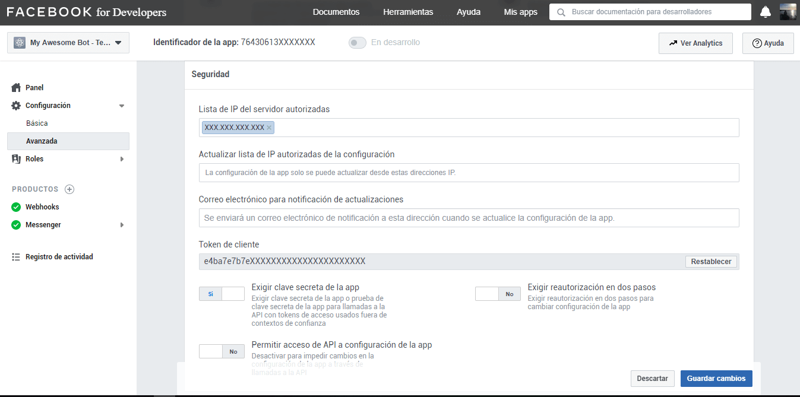
</p>

#### Workplace App

In the configuration of the app, we go down to the **Security Settings** section, where we will activate the option to **require a secret key test of the app**, and then we will enter our **public IP**.


<p align="center">
    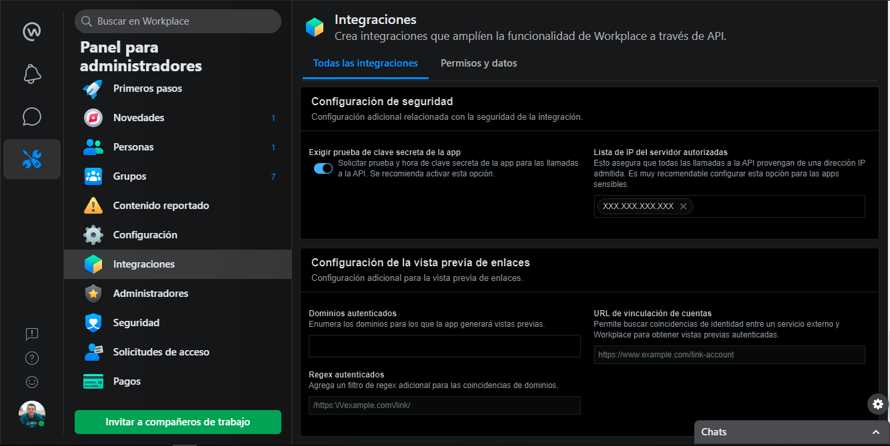
</p>

<a name="troubleshooting"></a>

## 🤦‍♂️Troubleshooting

#### Workplace App

##### ❌ (#200) To subscribe to the messages field

> (#200) To subscribe to the messages field, one of these permissions is needed: pages_messaging. To subscribe to the messaging_postbacks field, one of these permissions is needed: pages_messaging

You can solve this problem by configuring the webhook without selecting the subscriptions, then saving the configuration, then re-entering the app configuration and re-validating the webhook with the selected subscriptions.

<a name="contributing"></a>

## 💡 Contributing

Requests are welcome. For important changes, please open a topic first to discuss what you would like to change.

Please be sure to update the tests and documentation as appropriate.

<a name="author"></a>

## 👨‍💻 Author

[](mailto:mdelgado@tresdoce.com.ar 'Send email to Mex')

<a name="license"></a>
📜 [License MIT](license.md)
